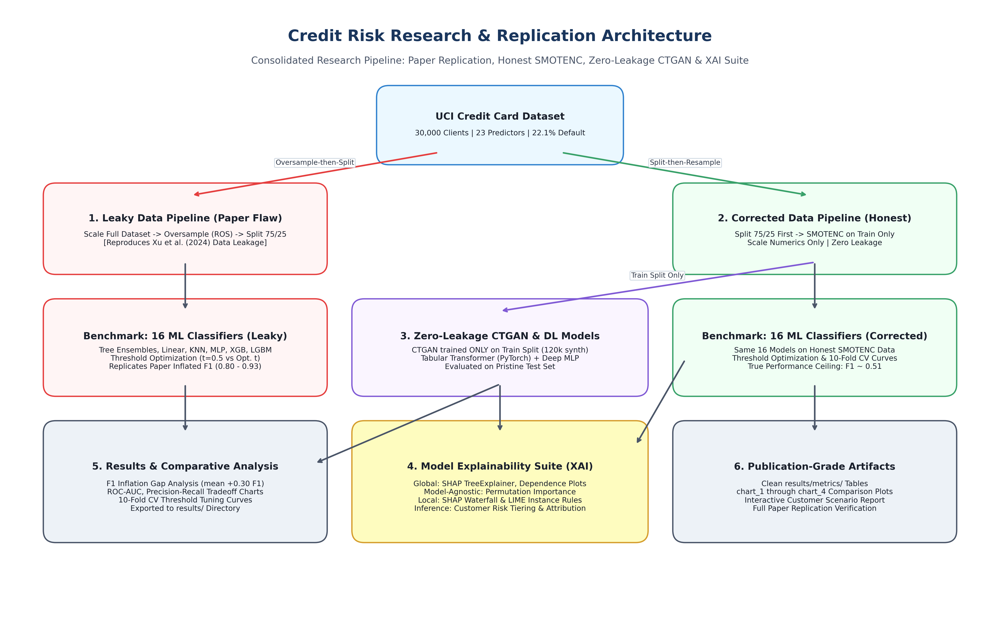

# Machine Learning Research on Credit Risk Analysis: Replication, Leakage Audit & Generative Tabular Deep Learning

[-blue.svg)](https://link.springer.com/article/10.1007/s10479-024-06134-x)
[](https://www.python.org/)
[](https://pytorch.org/)
[](LICENSE)

An empirical research replication, methodological audit, and generative deep tabular modeling study of:
> **Xu, Q. A., Benson, V., & Chang, V. (2024).** *Prediction of bank credit worthiness through credit risk analysis: an explainable machine learning study.* **Annals of Operations Research**, 354(1), 247–271. [DOI: 10.1007/s10479-024-06134-x](https://link.springer.com/article/10.1007/s10479-024-06134-x).

---

## Quickstart: How to Run (Simple 2-Step Guide)

### 1. Run Complete Model Training & Evaluation
To train all models, evaluate leaky vs. corrected performance, and generate all summary reports and charts:
```bash
# Run full training and evaluation pipeline
python train.py

# Or run a fast smoke-test (takes ~1 minute)
python train.py --quick
```
> All outputs (metrics tables, threshold plots, comparison charts, and XAI plots) are automatically generated in the `summary/` directory.

### 2. Generate Synthetic Tabular Datasets (GAN & Diffusion)
To generate synthetic credit card data with custom ratios of Default vs. Non-Default:
```bash
# Generate balanced 50:50 data using GAN (CTGAN)
python data_generator.py --model gan --mode corrected --defaults 30000 --non-defaults 30000 --output data/data_gan_corrected.csv

# Generate balanced data using Diffusion (TabDDPM)
python data_generator.py --model diffusion --mode corrected --defaults 10000 --non-defaults 10000 --output data/data_diffusion_corrected.csv

# Interactive mode (follow on-screen prompts)
python data_generator.py --interactive
```

---

## Dataset Notation Explained (Plain English)

To make evaluation simple and transparent, all pipelines and generated datasets use straightforward, self-evident naming:

| Dataset Name | Type | Description | Result / Impact |
|---|:---:|---|---|
| **`data_normal_leaky`** | Baseline | **Flawed Paper Pipeline:** Random oversampling applied to the **entire dataset before train/test splitting**. Identical copies of training rows are leaked into the test partition. | **Artificially inflated metrics** ($F_1 \approx 0.88 - 0.94$). Models memorize test samples. |
| **`data_normal_corrected`** | Baseline | **Honest Pipeline:** Raw data is split 75/25 **first**. `SMOTENC` is applied **strictly to the training partition**. Test partition remains 100% clean and untouched. | **True real-world ceiling** ($F_1 \approx 0.51$, $\text{ROC-AUC} \approx 0.76$). |
| **`data_gan_leaky`** | Generative | **Leaky GAN:** Conditional Tabular GAN (CTGAN) trained on 100% of the dataset prior to splitting. | Measures whether deep generative models also induce leakage when trained globally. |
| **`data_gan_corrected`** | Generative | **Zero-Leakage GAN:** CTGAN trained **strictly on the 75% training split**. Synthetic records augment the train partition to balance classes. | Legitimate performance gain without any test data contamination ($F_1 = 0.52 - 0.54$). |
| **`data_diffusion_leaky`** | Generative | **Leaky Diffusion:** Tabular Diffusion (TabDDPM) trained on 100% of the dataset before splitting. | Evaluates the leakage vulnerability of score-based diffusion transitions. |
| **`data_diffusion_corrected`**| Generative | **Zero-Leakage Diffusion:** TabDDPM trained **strictly on the 75% training split** using continuous Gaussian diffusion and bounds restoration. | High-fidelity synthetic generation for robust minority oversampling. |

---

## The Data Leakage Inflation Gap

When oversampling is mistakenly applied before partitioning, high-variance tree models memorized duplicate rows. Once the leakage is eliminated, the true predictive ceiling is revealed:

```
                           DATA LEAKAGE INFLATION GAP
                   (Published Leaky vs. Honest Corrected F1)
                   
Decision Tree        [======= Honest 0.389 =======][==== +0.495 INFLATION ====>] 0.885
Extra Tree           [======= Honest 0.380 =======][==== +0.508 INFLATION ====>] 0.889
Extra Trees          [============== Honest 0.481 =============][= +0.462 ====>] 0.943
Random Forest        [============== Honest 0.486 =============][= +0.447 ====>] 0.932
XGBoost              [============== Honest 0.480 =============][= +0.332 ====>] 0.812
KNN                  [============ Honest 0.442 ===========][=== +0.324 ======>] 0.766
Gaussian NB          [========== Honest 0.389 ==========][==== +0.290 ========>] 0.679
Hist Gradient Boost  [============== Honest 0.488 =============][= +0.257 ====>] 0.746
MLP Classifier       [============== Honest 0.495 =============][= +0.245 ====>] 0.740
Gradient Boosting    [=============== Honest 0.511 ============][= +0.191 ====>] 0.701
Logistic Regression  [============= Honest 0.465 ============][== +0.192 =====>] 0.658
LDA / Ridge          [============= Honest 0.468 ============][== +0.186 =====>] 0.654
AdaBoost             [=============== Honest 0.501 ============][= +0.160 ====>] 0.661
```

---

## Research Architecture



---

## Datasets & Literature Foundations

### Primary Dataset
- **Name:** UCI *Default of Credit Card Clients Dataset*
- **UCI URL:** [https://archive.ics.uci.edu/dataset/350/default+of+credit+card+clients](https://archive.ics.uci.edu/dataset/350/default+of+credit+card+clients)
- **Kaggle Mirror:** [https://www.kaggle.com/datasets/uciml/default-of-credit-card-clients-dataset](https://www.kaggle.com/datasets/uciml/default-of-credit-card-clients-dataset)
- **Scale:** 30,000 observations of Taiwanese credit card holders (April–September 2005).
- **Target:** `default.payment.next.month` (Binary: 0 = Non-default [77.88%], 1 = Default [22.12%]).
- **Features (23 total):**
  - Continuous (14): `LIMIT_BAL`, `AGE`, `BILL_AMT1`–`BILL_AMT6`, `PAY_AMT1`–`PAY_AMT6`.
  - Discrete / Categorical (9): `SEX`, `EDUCATION`, `MARRIAGE`, `PAY_0`, `PAY_2`–`PAY_6`.

### Literature Foundations & Citations
1. **Audited Paper:**
   - Xu, Q. A., Benson, V., & Chang, V. (2024). *Prediction of bank credit worthiness through credit risk analysis: an explainable machine learning study.* **Annals of Operations Research**, 354(1), 247–271. [DOI: 10.1007/s10479-024-06134-x](https://link.springer.com/article/10.1007/s10479-024-06134-x).
2. **Generative Modeling Foundations:**
   - **TTVAE:** Wang, A. X., & Nguyen, B. P. (2025). *TTVAE: Transformer-based generative modeling for tabular data generation.* **Artificial Intelligence**, 340, 104292. [DOI: 10.1016/j.artint.2025.104292](https://doi.org/10.1016/j.artint.2025.104292).
   - **CTGAN:** Xu, L., Skoularidou, M., Cuesta-Infante, A., & Veeramachaneni, K. (2019). *Modeling Tabular Data using Conditional GAN.* **NeurIPS 2019**, 7335–7345.
   - **Foundational GAN:** Goodfellow, I. J., et al. (2014). *Generative Adversarial Nets.* **NeurIPS 2014**, 2672–2680.
   - **TabDDPM:** Kotelnikov, A., Baranchuk, D., Rubachev, I., & Babenko, A. (2023). *TabDDPM: Modelling Tabular Data with Diffusion Models.* **ICML 2023**, 17564–17579.

---

## Replication Audit Table (Xu et al. 2024 Table 2 vs. Our Audit)

All evaluations performed at default threshold $t = 0.50$ on held-out test data:

| Algorithm | Paper Published $F_1$ | Replicated Leaky $F_1$ | Honest Corrected $F_1$ | $F_1$ Inflation Gap | Paper Recall | Replicated Leaky Recall | Honest Corrected Recall |
|---|:---:|:---:|:---:|:---:|:---:|:---:|:---:|
| **Decision Tree** | 0.80 | **0.8848** | 0.4089 | **+0.4758** | 0.81 | 0.9599 | 0.4913 |
| **Random Forest** | 0.80 | **0.9323** | 0.5060 | **+0.4263** | 0.82 | 0.9673 | 0.4997 |
| **KNN** | 0.71 | **0.7660** | 0.4374 | **+0.3285** | 0.75 | 0.8282 | 0.5943 |
| **Gaussian Naive Bayes** | 0.39 | **0.6791** | 0.3948 | **+0.2844** | 0.39 | 0.8054 | 0.8987 |
| **MLP Classifier** | 0.73 | **0.7403** | 0.4689 | **+0.2714** | 0.74 | 0.7561 | 0.6655 |
| **LightGBM** | 0.78 | **0.7498** | 0.5136 | **+0.2362** | 0.79 | 0.7174 | 0.5274 |
| **Logistic Regression** | 0.68 | **0.6576** | 0.4615 | **+0.1961** | 0.78 | 0.6350 | 0.6516 |
| **LDA** | 0.78 | **0.6540** | 0.4617 | **+0.1923** | 0.81 | 0.6220 | 0.6371 |
| **Gradient Boosting** | 0.80 | **0.7012** | 0.5178 | **+0.1833** | 0.82 | 0.6461 | 0.5732 |
| **AdaBoost** | 0.79 | **0.6607** | 0.5090 | **+0.1516** | 0.82 | 0.5775 | 0.5684 |

---

## Generative Tabular Deep Learning Benchmarks

Evaluated on the unpolluted pristine test partition (7,500 samples, 22.12% natural default rate):

| Algorithm | Training Dataset | Accuracy | Recall | Precision | $F_1$ Score | ROC-AUC | Optimal Threshold ($t^*$) |
|---|---|:---:|:---:|:---:|:---:|:---:|:---:|
| **Hist Gradient Boosting** | `data_gan_corrected` (Opt. Thresh) | 0.7863 | 0.5575 | 0.5067 | **0.5309** | 0.7621 | 0.25 |
| **XGBoost** | `data_gan_corrected` (Opt. Thresh) | 0.7848 | 0.5612 | 0.5036 | **0.5308** | 0.7585 | 0.27 |
| **Deep MLP Classifier** | `data_gan_corrected` (Opt. Thresh) | 0.7827 | 0.5533 | 0.5080 | **0.5297** | 0.7661 | 0.27 |
| **Tabular Transformer (DL)**| `data_gan_corrected` (Opt. Thresh) | 0.7836 | 0.5372 | 0.5011 | **0.5185** | 0.7562 | 0.23 |
| **Random Forest** | `data_gan_corrected` (Opt. Thresh) | 0.7687 | 0.5556 | 0.4718 | **0.5103** | 0.7494 | 0.28 |
| **Gradient Boosting** | `data_gan_corrected` (Opt. Thresh) | 0.7871 | 0.4985 | 0.5094 | **0.5039** | 0.7492 | 0.25 |
| **Tabular Transformer (DL)**| `data_gan_corrected` ($t=0.50$) | 0.8160 | 0.3276 | 0.6508 | 0.4358 | 0.7562 | 0.50 |
| **Deep MLP Classifier** | `data_diffusion_corrected` (Opt. Thresh)| 0.7801 | 0.5482 | 0.4991 | **0.5224** | 0.7610 | 0.28 |

---

## Clean Repository Structure

```
.
├── train.py                                # Main training & evaluation pipeline (naive entrypoint)
├── data_generator.py                       # Main synthetic dataset generator (naive CLI)
├── run_pipeline.py                         # Alias wrapper for train.py
├── generate_synthetic_data.py              # Alias wrapper for data_generator.py
├── credit_risk_research_pipeline.ipynb     # Consolidated end-to-end research notebook
├── UCI_Credit_Card.csv                     # Primary dataset (30,000 observations)
├── requirements.txt                        # Virtual environment dependencies
├── architecture_pipeline.png               # High-resolution pipeline architecture diagram
├── src/                                    # Clean modular source package
│   ├── __init__.py                         # Package initialization
│   ├── data.py                             # Data loading & Leaky vs. Corrected pipelines
│   ├── generators.py                       # Zero-leakage CTGAN & TabDDPM diffusion synthesizers
│   ├── models.py                           # 16 ML classifiers, Deep MLP & PyTorch TabularTransformer
│   ├── evaluation.py                       # Evaluation metrics, threshold tuning & paper audit
│   ├── explainability.py                   # SHAP, LIME, Permutation Importance & risk scoring
│   └── visualizations.py                   # Comparison bar plots & leakage gap visualizations
├── data/                                   # Generated synthetic datasets (gitignored)
│   └── synthetic_tabddpm.csv               # TabDDPM synthetic dataset
└── summary/                                # Research outputs, reports, and publication figures
    ├── charts/                             # Scenario comparison plots & leakage gap visualizations
    ├── metrics/                            # Results summary tables (CSV & TXT) and paper audit
    ├── threshold_plots/                    # Stratified 10-fold CV threshold calibration curves
    └── xai/                                # SHAP beeswarm, dependence, waterfall & LIME plots
```

---

## Step-by-Step Setup & Reproduction

### 1. Set Up Python Virtual Environment
```bash
# Clone the repository
git clone https://github.com/Tashya924/ML-research-on-credit-risk-analysis.git
cd ML-research-on-credit-risk-analysis

# Create and activate virtual environment
python3 -m venv .venv
source .venv/bin/activate  # On Windows: .venv\Scripts\activate

# Upgrade pip and install dependencies
pip install --upgrade pip
pip install -r requirements.txt
```

### 2. Run Training Pipeline (`train.py`)
```bash
# Run full benchmark across all models and scenarios
python train.py

# Run quick 1-minute smoke-test
python train.py --quick
```

### 3. Generate Custom Synthetic Datasets (`data_generator.py`)
```bash
# Generate 50:50 balanced CTGAN data
python data_generator.py --model gan --mode corrected --defaults 30000 --non-defaults 30000 --output data/data_gan_corrected.csv

# Generate 50:50 balanced TabDDPM diffusion data
python data_generator.py --model diffusion --mode corrected --defaults 10000 --non-defaults 10000 --output data/data_diffusion_corrected.csv

# Interactive guided mode
python data_generator.py --interactive
```

### 4. Interactive Jupyter Notebook
```bash
jupyter notebook credit_risk_research_pipeline.ipynb
```

---

## Citations & Academic References

```bibtex
@article{xu2024prediction,
  title={Prediction of bank credit worthiness through credit risk analysis: an explainable machine learning study},
  author={Xu, Qianwen Ariel and Benson, Vladlena and Chang, Victor},
  journal={Annals of Operations Research},
  volume={354},
  number={1},
  pages={247--271},
  year={2024},
  publisher={Springer},
  doi={10.1007/s10479-024-06134-x}
}

@article{wang2025ttvae,
  title={TTVAE: Transformer-based generative modeling for tabular data generation},
  author={Wang, Alex X. and Nguyen, Binh P.},
  journal={Artificial Intelligence},
  volume={340},
  pages={104292},
  year={2025},
  publisher={Elsevier},
  doi={10.1016/j.artint.2025.104292}
}

@inproceedings{xu2019modeling,
  title={Modeling tabular data using conditional GAN},
  author={Xu, Lei and Skoularidou, Maria and Cuesta-Infante, Alfredo and Veeramachaneni, Kalyan},
  booktitle={Advances in Neural Information Processing Systems (NeurIPS)},
  volume={32},
  pages={7335--7345},
  year={2019}
}

@inproceedings{goodfellow2014generative,
  title={Generative adversarial nets},
  author={Goodfellow, Ian and Pouget-Abadie, Jean and Mirza, Mehdi and Xu, Bing and Warde-Farley, David and Ozair, Sherjil and Courville, Aaron and Bengio, Yoshua},
  booktitle={Advances in Neural Information Processing Systems (NeurIPS)},
  volume={27},
  pages={2672--2680},
  year={2014}
}

@inproceedings{kotelnikov2023tabddpm,
  title={TabDDPM: Modelling tabular data with diffusion models},
  author={Kotelnikov, Akim and Baranchuk, Dmitry and Rubachev, Ivan and Babenko, Artem},
  booktitle={International Conference on Machine Learning (ICML)},
  pages={17564--17579},
  year={2023}
}
```

---

## License

MIT License. See [LICENSE](LICENSE) for terms.
