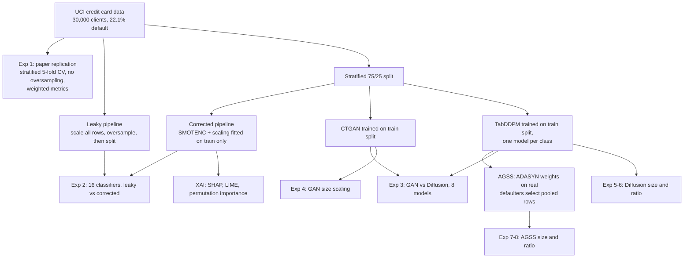

# Credit Risk ML Research: Replication, Leakage Audit and Generative Oversampling

[-blue.svg)](https://doi.org/10.1007/s10479-024-06134-x)
[](https://www.python.org/)
[](https://pytorch.org/)

A replication and methodological audit of:

> Chang, V., Xu, Q. A., Akinloye, S. H., Benson, V., & Hall, K. (2025). *Prediction of bank credit worthiness through credit risk analysis: an explainable machine learning study.* **Annals of Operations Research**, 354, 247–271 (published online 8 July 2024). [DOI: 10.1007/s10479-024-06134-x](https://doi.org/10.1007/s10479-024-06134-x)

The project (1) reproduces the paper's Table 2, (2) measures what the paper's *described* preprocessing (oversampling before the train/test split) does to the scores, (3) builds an honest zero-leakage baseline, and (4) tests whether synthetic data from a GAN (CTGAN), a diffusion model (TabDDPM) or Adaptive Generative Synthetic Sampling (AGSS) improves default prediction.

---

## Key findings

1. **Table 2 is reproduced without any oversampling.** Stratified 5-fold CV on the original data with *weighted* precision / recall / F1 matches the published accuracy and recall within 0.005 for 9 of 10 models (LightGBM: 0.03) and F1 within 0.016 (`leaky_replication.csv`). Weighted scores are dominated by the 78% non-default class (weighted recall equals accuracy), so they overstate how well defaulters are detected.
2. **The procedure the paper describes would leak.** Random oversampling before the split puts copies of the same defaulters in both train and test. In that setup Random Forest reaches F1 0.93 and Decision Tree 0.88 — far above both the paper (0.80) and the honest pipeline (0.51 / 0.41) (`leaky_vs_corrected.csv`).
3. **Honest ceiling:** with the split done first and SMOTENC applied to the training part only, the best models reach defaulter-class **F1 ≈ 0.51–0.52 and ROC-AUC ≈ 0.75–0.76** at the default threshold.
4. **Synthetic data quality:** TabDDPM reproduces the real feature distributions closely (median per-feature KS statistic 0.040, max 0.10); CTGAN is weaker (median 0.149, max 0.57 on `PAY_AMT1`) (`synthetic_data_statistical_fidelity.csv`).
5. **More synthetic data does not help.** Adding 100k–1M TabDDPM rows leaves F1 and ROC-AUC flat; adding CTGAN rows makes them worse as size grows. With a tuned threshold, the best augmented model (F1 0.546) is no better than Gradient Boosting trained on the real data alone (F1 0.545, ROC-AUC 0.779); Random Forest gains about 0.01 F1 from diffusion rows.
6. **Default ratio matters only at the default 0.5 threshold.** A 50% defaulter mix gives the best F1 at t = 0.50; once the threshold is tuned the ratio barely matters (Gradient Boosting F1 0.525–0.546), and 90% defaulters is slightly worse.
7. **AGSS is slightly worse than plain diffusion sampling** in most comparisons (typically F1 −0.005 to −0.05, ROC-AUC −0.003 to −0.03). On this dataset most defaulters already have mostly non-default neighbours, so the adaptive weights are nearly flat and the extra samples land where the classes overlap.

---

## Quickstart

```bash
git clone https://github.com/Tashya924/ML-research-on-credit-risk-analysis.git
cd ML-research-on-credit-risk-analysis
python3 -m venv .venv && source .venv/bin/activate      # Windows: .venv\Scripts\activate
pip install -r requirements.txt

python train.py --quick          # smoke test of all 8 experiments (~5 min once caches exist)
python train.py --skip-sizes     # experiments 1-3 only
python train.py                  # full run (size scaling up to 1M rows)
```

**TabDDPM requirement.** The diffusion model runs through [`synthcity`](https://github.com/vanderschaarlab/synthcity) in a separate Python 3.10 environment created automatically with [`uv`](https://docs.astral.sh/uv/). Install `uv` first. On first use, training takes about 8 minutes per class (2,000 iterations, CPU); generating the 1M-row pool for the size experiments takes about 1.5 hours. Everything is cached in `data/` (git-ignored).

Useful options:

| Option | Meaning |
|---|---|
| `--quick` | Small sizes and fewer models |
| `--skip-cv`, `--skip-xai`, `--skip-sizes` | Skip threshold curves, SHAP/LIME, or experiments 4–8 |
| `--gan-sizes N ...` | GAN sizes for experiment 4 |
| `--diffusion-sizes N ...` | Diffusion / AGSS sizes for experiments 5 and 7 (0 = real data only) |
| `--diffusion-ratios R ...` | Default ratios for experiments 6 and 8 (default 0.1 0.22 0.3 0.5 0.7 0.9) |
| `--ratio-samples N` | Synthetic rows per ratio (default 60,000) |
| `--ddpm-data PATH` | Use an existing TabDDPM file for experiment 3 instead of generating one |

---

## Pipeline


```mermaid
flowchart TD
    D["UCI credit card data<br/>30,000 clients, 22.1% default"] --> R["Exp 1: paper replication<br/>stratified 5-fold CV, no oversampling,<br/>weighted metrics"]
    D --> L["Leaky pipeline<br/>scale all rows, oversample, then split"]
    D --> S["Stratified 75/25 split"]
    S --> C["Corrected pipeline<br/>SMOTENC + scaling fitted on train only"]
    L --> E2["Exp 2: 16 classifiers, leaky vs corrected"]
    C --> E2
    S --> G["CTGAN trained on train split"]
    S --> P["TabDDPM trained on train split,<br/>one model per class"]
    P --> A["AGSS: ADASYN weights on real<br/>defaulters select pooled rows"]
    G --> E3["Exp 3: GAN vs Diffusion, 8 models"]
    P --> E3
    G --> E4["Exp 4: GAN size scaling"]
    P --> E56["Exp 5-6: Diffusion size and ratio"]
    A --> E78["Exp 7-8: AGSS size and ratio"]
    C --> X["XAI: SHAP, LIME, permutation importance"]
```

Every experiment after Exp 1 is scored on the same untouched test set: 7,500 real clients with the natural 22.1% default rate.

---

## Dataset

- **UCI Default of Credit Card Clients** — [UCI](https://archive.ics.uci.edu/dataset/350/default+of+credit+card+clients) · [Kaggle mirror](https://www.kaggle.com/datasets/uciml/default-of-credit-card-clients-dataset). Included as `UCI_Credit_Card.csv`.
- 30,000 Taiwanese credit card holders, April–September 2005. Amounts in NT dollars. (The paper describes it as a UK dataset in pounds; its own appendix lists NT dollars.)
- Target `default.payment.next.month`: 23,364 non-default (77.88%), 6,636 default (22.12%).
- 23 features: `LIMIT_BAL`, `SEX`, `EDUCATION`, `MARRIAGE`, `AGE`, repayment status `PAY_0`, `PAY_2`–`PAY_6`, bill amounts `BILL_AMT1`–`6`, payments `PAY_AMT1`–`6`. The code treats `SEX`, `EDUCATION`, `MARRIAGE` and the six `PAY_*` status columns as categorical.

---

## Results

All tables below are read from `summary/metrics/`. "Optimal threshold" rows pick the F1-maximising threshold **on the test set**, so they are optimistic upper bounds; t = 0.50 rows are not tuned. Each result is a single run with seed 42.

### Experiment 1 — Paper Table 2 replication (`leaky_replication.csv`)

Stratified 5-fold CV on the original (not oversampled) data; weighted metrics as in the paper. Logistic Regression is standardised inside each fold.

| Algorithm | Paper F1 | Replicated F1 | Paper accuracy | Replicated accuracy |
|---|:---:|:---:|:---:|:---:|
| Gradient Boosting | 0.80 | 0.800 | 0.82 | 0.821 |
| Random Forest | 0.80 | 0.796 | 0.82 | 0.819 |
| Decision Tree | 0.80 | 0.794 | 0.81 | 0.813 |
| AdaBoost | 0.79 | 0.792 | 0.82 | 0.818 |
| LDA | 0.78 | 0.775 | 0.81 | 0.811 |
| LightGBM | 0.78 | 0.795 | 0.79 | 0.821 |
| MLP | 0.73 | 0.717 | 0.74 | 0.741 |
| KNN | 0.71 | 0.720 | 0.75 | 0.754 |
| Logistic Regression | 0.68 | 0.694 | 0.78 | 0.782 |
| Gaussian Naive Bayes | 0.39 | 0.376 | 0.39 | 0.380 |

Model settings in `get_paper_replication_models` (e.g. Random Forest depth 12, Decision Tree depth 8, Logistic Regression `C=0.0001`, LightGBM depth 3) were chosen to match the published numbers.

### Experiment 2 — Leaky vs corrected pipeline (`leaky_vs_corrected.csv`)

Defaulter-class (class 1) metrics at t = 0.50, top models by corrected F1.

| Algorithm | Leaky F1 | Corrected F1 | Leaky ROC-AUC | Corrected ROC-AUC | Corrected recall | Corrected precision |
|---|:---:|:---:|:---:|:---:|:---:|:---:|
| Gradient Boosting | 0.701 | **0.518** | 0.797 | 0.765 | 0.573 | 0.472 |
| LightGBM | 0.750 | 0.514 | 0.845 | 0.759 | 0.527 | 0.501 |
| AdaBoost | 0.661 | 0.509 | 0.773 | 0.748 | 0.568 | 0.461 |
| Hist Gradient Boosting | 0.746 | 0.508 | 0.843 | 0.753 | 0.549 | 0.474 |
| Random Forest | 0.932 | 0.506 | 0.979 | 0.741 | 0.500 | 0.512 |
| XGBoost | 0.812 | 0.477 | 0.890 | 0.739 | 0.470 | 0.485 |
| Logistic Regression | 0.658 | 0.462 | 0.719 | 0.720 | 0.652 | 0.357 |
| KNN | 0.766 | 0.437 | 0.827 | 0.683 | 0.594 | 0.346 |
| Decision Tree | 0.885 | 0.409 | 0.874 | 0.616 | 0.491 | 0.350 |

The leaky test set is 50% defaulters (vs 22% in reality) and many of its defaulter rows are copies of training rows. Both effects raise F1, so the gap mixes memorisation with a change in class balance. Flexible models that can memorise rows (Random Forest, Decision Tree, Extra Trees, KNN) show the largest gaps.

### Experiment 3 — GAN vs Diffusion augmentation (`GAN_vs_Diffusion.csv`)

Real training rows plus 120,000 CTGAN rows (natural class mix, about 18% defaulters) or 6,000 TabDDPM rows (50% defaulters). Optimal-threshold rows:

| Model | GAN F1 | GAN ROC-AUC | Diffusion F1 | Diffusion ROC-AUC |
|---|:---:|:---:|:---:|:---:|
| Gradient Boosting | 0.512 | 0.748 | **0.542** | **0.779** |
| Tabular Transformer | 0.517 | 0.759 | 0.539 | 0.776 |
| Deep MLP | 0.518 | 0.757 | 0.532 | 0.771 |
| AdaBoost | 0.480 | 0.719 | 0.524 | 0.761 |
| Random Forest | 0.518 | 0.750 | 0.522 | 0.759 |
| XGBoost | 0.535 | 0.767 | 0.520 | 0.763 |
| Logistic Regression | 0.450 | 0.672 | 0.512 | 0.716 |
| Decision Tree | 0.383 | 0.604 | 0.401 | 0.614 |

Because the CTGAN rows are not rebalanced, this comparison also differs in class balance, not only in generator.

### Experiments 4, 5, 7 — Dataset size scaling (`Gan_size.csv`, `Diffusion_size.csv`, `AGSS_size.csv`)

Gradient Boosting (HistGradientBoosting) trained on 22,500 real rows plus *N* synthetic rows (Diffusion and AGSS: 50% defaulters; GAN: natural mix). Optimal-threshold F1 / ROC-AUC:

| Synthetic rows | GAN F1 | GAN AUC | Diffusion F1 | Diffusion AUC | AGSS F1 | AGSS AUC |
|---|:---:|:---:|:---:|:---:|:---:|:---:|
| 0 (real only) | — | — | 0.545 | 0.779 | 0.545 | 0.779 |
| 100k | 0.532 | 0.770 | 0.533 | 0.771 | 0.533 | 0.764 |
| 200k | 0.513 | 0.757 | 0.539 | 0.770 | 0.534 | 0.766 |
| 300k | 0.510 | 0.751 | 0.540 | 0.769 | 0.538 | 0.769 |
| 400k | 0.498 | 0.745 | 0.539 | 0.771 | 0.538 | 0.766 |
| 500k | 0.498 | 0.740 | 0.537 | 0.769 | 0.534 | 0.767 |
| 1M | 0.459 | 0.713 | 0.540 | 0.768 | 0.542 | 0.770 |

Deep MLP, Random Forest and Logistic Regression are in the CSVs and follow the same pattern. At 1M rows AGSS uses the entire diffusion pool, so it converges to plain diffusion sampling. `Gan_size.csv` has no real-only column because it was produced before that baseline was added.

### Experiments 6 and 8 — Default (risk : no-risk) ratio (`Diffusion_ratio.csv`, `AGSS_ratio.csv`)

60,000 synthetic rows with the given share of defaulters, added to the real training data. Gradient Boosting:

| Synthetic default share | Diffusion F1 (t = 0.50) | Diffusion F1 (opt.) | AGSS F1 (t = 0.50) | AGSS F1 (opt.) |
|---|:---:|:---:|:---:|:---:|
| real only | 0.475 | 0.545 | 0.475 | 0.545 |
| 10% | 0.413 | 0.546 | 0.373 | 0.534 |
| 22% (natural) | 0.477 | 0.542 | 0.480 | 0.536 |
| 30% | 0.494 | 0.542 | 0.510 | 0.536 |
| 50% | **0.536** | 0.537 | **0.531** | 0.531 |
| 70% | 0.529 | 0.532 | 0.494 | 0.533 |
| 90% | 0.490 | 0.525 | 0.446 | 0.528 |

### Synthetic data fidelity (`synthetic_data_statistical_fidelity.csv`)

Per-feature mean, standard deviation, Kolmogorov–Smirnov statistic and Wasserstein distance of CTGAN and TabDDPM rows against the real training partition. Median KS over the 23 features: CTGAN 0.149, TabDDPM 0.040. The target row differs by design (TabDDPM rows are 50% defaulters).

### Explainability

`train.py` explains the corrected Gradient Boosting model with a SHAP beeswarm, dependence plots (`PAY_0`, `LIMIT_BAL`, `BILL_AMT1`), SHAP waterfalls and LIME for three applicants, and permutation importance for Gradient Boosting and Random Forest. Plots are written to `summary/xai/` (git-ignored). In both SHAP and permutation importance, September repayment status (`PAY_0`) is by far the strongest driver, followed by the credit limit (`LIMIT_BAL`).

---

## Methods

| Component | Implementation |
|---|---|
| Leaky pipeline | `src/data.py::prepare_leaky_pipeline` — global `StandardScaler`, `RandomOverSampler`, then random 75/25 split |
| Corrected pipeline | `src/data.py::prepare_corrected_pipeline` — stratified 75/25 split, `SMOTENC` on train only, scaler fitted on train only |
| Classifiers | `src/models.py` — 16 scikit-learn / XGBoost / LightGBM models, a 3-layer MLP (128-64-32) and a PyTorch Tabular Transformer |
| CTGAN | `src/generator_gan.py` — trained on the training split (20 epochs), values clipped to training bounds |
| TabDDPM | `src/generator_diffusion.py` — synthcity `ddpm`, one model per class, 2,000 iterations; `build_tabddpm_pool` caches a pool that size/ratio experiments sample without replacement |
| AGSS | `src/generator_agss.py` — each real defaulter gets a weight equal to the share of non-defaulters among its 5 nearest training neighbours (ADASYN); synthetic defaulters are drawn from the TabDDPM pool around each real defaulter in proportion to its weight (closest first); non-defaulters are drawn uniformly |
| Evaluation | `src/evaluation.py` — accuracy, class-1 precision / recall / F1, ROC-AUC at t = 0.50 and at the F1-optimal threshold; stratified 10-fold threshold curves |
| Explainability | `src/explainability.py` — SHAP, LIME, permutation importance, single-applicant risk scoring |

---

## Generating synthetic datasets directly

```bash
# CTGAN: 30,000 defaults + 30,000 non-defaults, trained on the 75% training split
python data_generator_gan.py --mode corrected --defaults 30000 --non-defaults 30000
python data_generator_gan.py --mode corrected --ratio 0.3 --total 60000
python data_generator_gan.py --interactive

# TabDDPM
python data_generator_diffusion.py --mode corrected --defaults 1000 --non-defaults 1000
python data_generator_diffusion.py --interactive
```

`--mode leaky` trains the generator on all 30,000 rows (including the test partition) for comparison. Leaky models are never cached where the corrected pipeline can reload them (CTGAN: no model cache; TabDDPM: `data/diffusion_leaky/`). Output goes to `data/data_<gan|diffusion>_<mode>.csv`.

---

## Repository structure

```
.
├── train.py                             # Runs experiments 1-8 and the XAI suite
├── data_generator_gan.py                # CLI: CTGAN datasets (corrected / leaky)
├── data_generator_diffusion.py          # CLI: TabDDPM datasets (corrected / leaky)
├── credit_risk_research_pipeline.ipynb  # Notebook walkthrough of the main experiments
├── UCI_Credit_Card.csv                  # Dataset (30,000 rows)
├── requirements.txt
├── src/
│   ├── data.py                          # Loading, leaky and corrected pipelines
│   ├── models.py                        # Classifiers, Deep MLP, Tabular Transformer
│   ├── evaluation.py                    # Metrics, thresholds, replication, size / ratio benchmarks
│   ├── generator_gan.py                 # CTGAN generator
│   ├── generator_diffusion.py           # TabDDPM generator and pool
│   ├── generator_agss.py                # Adaptive Generative Synthetic Sampling
│   ├── explainability.py                # SHAP, LIME, permutation importance, risk scoring
│   └── visualizations.py                # Charts and synthetic-data fidelity
├── summary/metrics/                     # Result tables (tracked in git)
│   ├── leaky_replication.csv            # Exp 1
│   ├── leaky_vs_corrected.csv           # Exp 2
│   ├── GAN_vs_Diffusion.csv             # Exp 3
│   ├── Gan_size.csv                     # Exp 4
│   ├── Diffusion_size.csv               # Exp 5
│   ├── Diffusion_ratio.csv              # Exp 6
│   ├── AGSS_size.csv                    # Exp 7
│   ├── AGSS_ratio.csv                   # Exp 8
│   └── synthetic_data_statistical_fidelity.csv
└── data/                                # Generated data and model caches (git-ignored)
```

Charts, threshold plots and XAI figures are written to `summary/charts/`, `summary/threshold_plots/` and `summary/xai/` (git-ignored).

---

## Limitations

- Single train/test split and single seed; many differences between augmentation methods are around 0.005–0.01 F1. Repeated splits with confidence intervals are needed before claiming one method is better.
- "Optimal threshold" results are tuned on the test set and are therefore optimistic.
- CTGAN is trained for 20 epochs and sampled in its natural class mix; longer training and explicit class counts would make the GAN comparison fairer.
- TabDDPM models every column as continuous (tiny noise is added, values are rounded and clipped back), so a small share of generated category codes can be invalid.

---

## References

```bibtex
@article{chang2025prediction,
  title   = {Prediction of bank credit worthiness through credit risk analysis: an explainable machine learning study},
  author  = {Chang, Victor and Xu, Qianwen Ariel and Akinloye, Shola Habib and Benson, Vladlena and Hall, Karl},
  journal = {Annals of Operations Research},
  volume  = {354},
  pages   = {247--271},
  year    = {2025},
  doi     = {10.1007/s10479-024-06134-x}
}

@inproceedings{xu2019ctgan,
  title     = {Modeling Tabular Data using Conditional {GAN}},
  author    = {Xu, Lei and Skoularidou, Maria and Cuesta-Infante, Alfredo and Veeramachaneni, Kalyan},
  booktitle = {Advances in Neural Information Processing Systems},
  volume    = {32},
  year      = {2019}
}

@inproceedings{kotelnikov2023tabddpm,
  title     = {{TabDDPM}: Modelling Tabular Data with Diffusion Models},
  author    = {Kotelnikov, Akim and Baranchuk, Dmitry and Rubachev, Ivan and Babenko, Artem},
  booktitle = {International Conference on Machine Learning},
  pages     = {17564--17579},
  year      = {2023}
}

@inproceedings{he2008adasyn,
  title     = {{ADASYN}: Adaptive synthetic sampling approach for imbalanced learning},
  author    = {He, Haibo and Bai, Yang and Garcia, Edwardo A. and Li, Shutao},
  booktitle = {IEEE International Joint Conference on Neural Networks},
  pages     = {1322--1328},
  year      = {2008}
}

@article{chawla2002smote,
  title   = {{SMOTE}: Synthetic Minority Over-sampling Technique},
  author  = {Chawla, Nitesh V. and Bowyer, Kevin W. and Hall, Lawrence O. and Kegelmeyer, W. Philip},
  journal = {Journal of Artificial Intelligence Research},
  volume  = {16},
  pages   = {321--357},
  year    = {2002}
}
```
